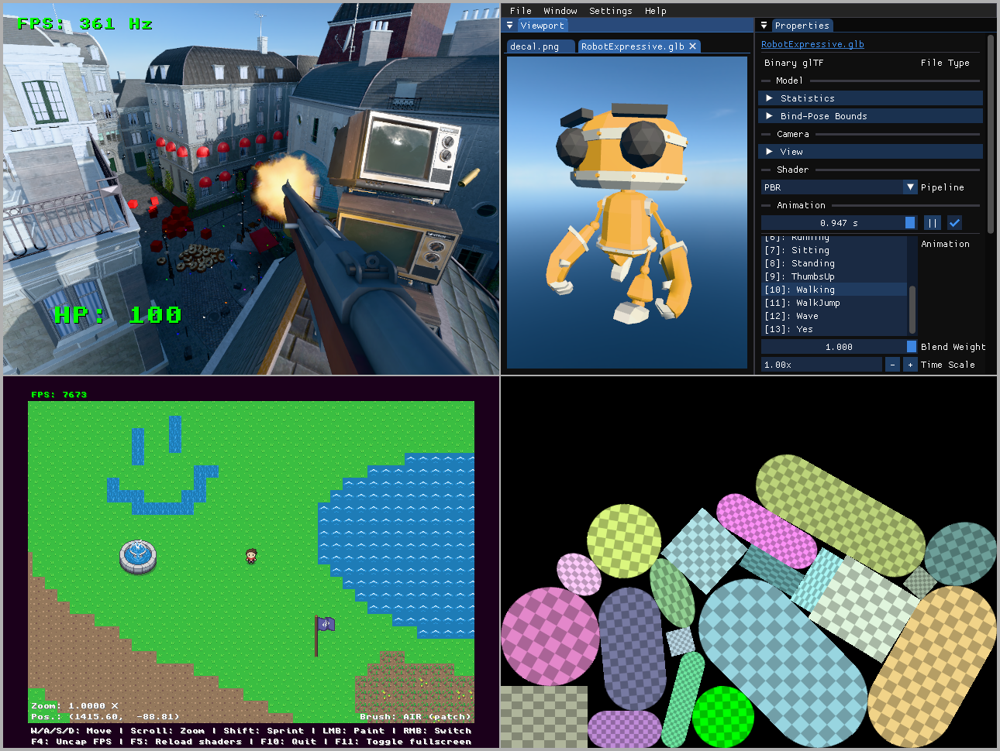

# GREM: Game/Rendering Engine Modules for C++

GREM is a modular, cross-platform C++ library for building games, game engines and interactive applications.



> Screenshots of the example projects [fps](examples/fps/main.cpp), [asset_viewer](tools/asset_viewer/main.cpp), [tiles](examples/tiles/main.cpp) and [physics](examples/physics/main.cpp), running on a 2020-era Linux PC (5800X + RX 6800XT).<br>
> The examples contain third-party assets credited in [examples/data/CREDITS.md](examples/data/CREDITS.md).<br>
> The 3D scene in the upper left screenshot is adapted from [Amazon Lumberyard Bistro, Open Research Content Archive (ORCA)](http://developer.nvidia.com/orca/amazon-lumberyard-bistro), used under [CC-BY 4.0](https://creativecommons.org/licenses/by/4.0/).

## Examples

**rectangle**: Basic application that renders a rectangle | [Code (~80 lines)](examples/rectangle/main.cpp) | [Run in browser (2 MB .html)](https://donutvikingchap.github.io/GREM/bin/GREM-examples-rectangle.html)<sup>1</sup>

**physics**: 2D physics toy with draggable objects | [Code (~500 lines)](examples/physics/main.cpp) | [Run in browser (5 MB .html)](https://donutvikingchap.github.io/GREM/bin/GREM-examples-physics.html)<sup>1</sup>

**tiles**: Tile-based top-down 2D pixel art game with basic player collision code that renders animated tiles and sprite objects in a dynamically paintable GPU-resident sparse tilemap, sampled in a fullscreen shader from an array of JSON-configured tileset images | [Code (~3500 lines)](examples/tiles/main.cpp) | [Run in browser (4 MB .html)](https://donutvikingchap.github.io/GREM/bin/GREM-examples-tiles.html)<sup>1, 2</sup>

**fps**: Multiplayer FPS prototype with basic weapon handling, fully networked 3D physics, snapshot-based client-predicted server-authoritative netcode with subticked player commands, lag-compensated hit detection with bullet drop and short-range hitscan, splitscreen support with up to 9 local players per client by default, JSON-based runtime entity definitions and a multithreaded ECS architecture comprised of dynamically loaded game systems | [Code (~21000 lines)](examples/fps/main.cpp) | [Run in browser (20 MB .html)](https://donutvikingchap.github.io/GREM/bin/GREM-examples-fps.html)<sup>1, 3</sup>

**test_game**: Single-file demo of various features | [Code (~700 lines)](examples/test_game/main.cpp) | [Run in browser (16 MB .html)](https://donutvikingchap.github.io/GREM/bin/GREM-examples-test_game.html)<sup>1</sup>

**asset_viewer**: IMGUI-based tool for inspecting asset files | [Code (~3000 lines)](tools/asset_viewer/main.cpp) | [Run in browser (7 MB .html)](https://donutvikingchap.github.io/GREM/bin/GREM-asset-viewer.html)<sup>1</sup>

> <sup>1</sup> The web builds contain compiled code from the libraries listed in [ThirdPartyLegalNotices.md](https://donutvikingchap.github.io/GREM/bin/ThirdPartyLegalNotices.md).<br>
> <sup>2</sup> The tiles example uses ~0.5 to ~4 GB VRAM depending on zoom level.<br>
> <sup>3</sup> This web build of the FPS example is WebAssembly/WebGL 2-based, single-threaded, and runs a listen server over an emulated socket that supports local splitscreen multiplayer only (Players -> Add Local Player). A basic sandbox [flat map (debug variant)](examples/data/fps/maps/flatland.json5) is included. Press X to switch fire modes and G to spawn boxes! See [configuration/player1.json](examples/data/fps/configuration/player1.json) for more controls. (Be careful of accidentally closing the tab with Ctrl+W when crouching.)

## Features

GREM implements a sizable subset of the core functionality needed to make a high-quality cross-platform game engine, provided through simple C++ APIs with efficient data-oriented implementations, focused on ease of use, low overhead and consistent performance across a wide range of hardware.

The library consists of one shared core module and 11 optional modules, designed to provide orthogonal functionality that can be integrated per-module into a larger system/engine on an as-needed basis, or combined to form an application framework for new projects.

As a combined package, GREM offers a free, permissively licensed, platform-agnostic game framework, based on open standards and a small number of high-quality open-source dependencies, with the potential for very low input latency, high motion clarity and few shader compilations compared to mainstream game engines, while also allowing for high-level architectural decisions, such as scene/entity format, asset loading strategy, netcode/interest management, configuration files, main() structure, etc. to be made independently, based on each application's specific use case (with examples provided as a potential starting point).

The modules provided by GREM are:

### `application` - Application shell

- [Application](include/GREM/application/Application.hpp) base class for a platform-agnostic main loop:
    - Provides per-frame `update()` and `display()` callbacks and a fixed-timestep `tick()` callback.
    - Simplifies frame rate independence, interpolation and high-refresh-rate monitor support.
    - Includes an optional frame rate limiter (with or without sleeping for reduced CPU usage, dynamically calibrated to reduce stutters caused by low scheduling precision).
    - Uses `requestAnimationFrame()` when building for web.
- [VirtualFilesystem](include/GREM/application/VirtualFilesystem.hpp) for compressed asset packs and mod support:
    - Provides uniform access to files in mounted directories and resource archives (zip files, etc.) through virtual filepaths.
    - Supports automatic archive mounting at startup for easy mod loading.
    - Supported by all resource loaders included with GREM.

### `audio` - Audio engine

- [Sound](include/GREM/audio/Sound.hpp) loading and dynamic [SoundMix](include/GREM/audio/SoundMix.hpp) mixing with support for various built-in or user-defined [filters](include/GREM/audio/filters.hpp).
- [SoundStage](include/GREM/audio/SoundStage.hpp) for playing 3D positional audio, background sounds and music to the default playback device.

### `events` - Events system

- [EventPump](include/GREM/events/EventPump.hpp) for on-demand [Event](include/GREM/events/Event.hpp) polling from the environment, such as user input and window size changes.
- [InputManager](include/GREM/events/InputManager.hpp) for mapping physical [Input](include/GREM/events/Input.hpp) events to abstract action numbers based on a specific user's bindings, supporting simultaneous keyboard, mouse, touch and controller input.

### `resource` - Resource loading

- [Image](include/GREM/resource/Image.hpp) saving/loading to/from `.jpg`/`.jpeg`, `.png`, `.hdr` and `.ktx2`, with support for loading and transcoding portable ETC1S or UASTC-compressed textures to native GPU formats.
- [Model](include/GREM/resource/Model.hpp) loading from `.obj` and `.gltf`/`.glb`, with support for standard metallic-roughness PBR or unlit materials, skeletal animation, vertex skinning, morph targets, texture coordinate transforms, compressed textures, punctual lights, collision shapes and rigid body physics data.

### `graphics` - Portable graphics hardware interface

- Unified graphics [Device](include/GREM/graphics/Device.hpp) API that manages the rendering context of a [Window](include/GREM/graphics/Window.hpp), with included backends for Vulkan 1.2, OpenGL 3.3 Core and OpenGL ES 3.0/WebGL 2.0.
- Renders [RenderPass](include/GREM/graphics/RenderPass.hpp) objects containing draw commands that may target a window's [Swapchain](include/GREM/graphics/Swapchain.hpp) or any off-screen [Texture](include/GREM/graphics/Texture.hpp).
- Supports vertex and fragment [shaders](include/GREM/graphics/shaders.hpp) written in GLSL with arbitrary custom [Mesh](include/GREM/graphics/Mesh.hpp) types, input/output formats, uniform/storage [buffer](include/GREM/graphics/buffers.hpp) layouts, specialization constants and pipeline configurations, all with auto-generated layout descriptions from plain C++ struct types.
- Instances consecutive draw commands of the same mesh automatically, while also supporting manual batching.
- Uses multi-draw indirect when rendering unordered draw command buffers on Vulkan, with shared vertex/index buffers and bindless textures to reduce context switching.
- Supports HDR render targets, multisampling, multiple windows and dynamic window resizing.
- Handles sRGB conversion automatically based on texture/swapchain format - shaders always work in linear Rec. 709 color space by default.
- Converts raw RGBA images (PNGs, etc.) to premultiplied alpha on texture upload by default, allowing for correct texture filtering when using alpha blending. (Compressed textures are assumed to be stored premultiplied. Straight alpha blending is also supported.)
- Limited to major API features that are supported across all backends to ensure portability to web and low-spec platforms (mobile, consoles, etc.). Notably, this excludes some relatively recent features like compute shaders and hardware-accelerated raytracing, but is still enough to implement everything demonstrated in the FPS example using tried-and-true techniques.
- Requires `resource`.

### `graphics_2d` - Baseline 2D graphics rendering

- [Renderer2D](include/GREM/graphics_2d/Renderer2D.hpp) for drawing batches of [Instances2D](include/GREM/graphics_2d/Instances2D.hpp) supporting shaded textured quads, triangles, rectangles, sprites, text and 2D triangle strip meshes through [Model2D](include/GREM/graphics_2d/Model2D.hpp).
- [Font2D](include/GREM/graphics_2d/Font2D.hpp) loading and [Text2D](include/GREM/graphics_2d/Text2D.hpp) shaping.
- [SpriteAtlas](include/GREM/graphics/SpriteAtlas.hpp) for packing sprites into an expandable square texture atlas at runtime.
- Requires `graphics`.

### `graphics_3d` - Baseline 3D graphics rendering

- [Renderer3D](include/GREM/graphics_3d/Renderer3D.hpp) for drawing batches of [Instances3D](include/GREM/graphics_3d/Instances3D.hpp) supporting [Model3D](include/GREM/graphics_3d/Model3D.hpp) meshes of various types, including unlit or metallic-roughness PBR materials, skeletal animation, vertex skinning and morph targets, with basic quantization for normals, tangents and vertex colors.
- Includes a tiled Z-binned Forward+ PBR shader, optimized for low latency, first-frame image clarity and MSAA support (ideal for competitive games, mid-range hardware and potentially VR), supporting:
    - [Lights3D](include/GREM/graphics_3d/Lights3D.hpp) for direct dynamic lighting from point/spot/directional light sources, with optional cube/rectangular/cascaded shadow maps.
    - [LightProbeVolumes3D](include/GREM/graphics_3d/LightProbeVolumes3D.hpp) for baked diffuse global illumination through grids of octahedron-mapped irradiance + distance/variance probes.
    - [ReflectionProbes3D](include/GREM/graphics_3d/ReflectionProbes3D.hpp) for baked specular reflections through box-projected cubemaps (using the alpha channel for holes to show the sky/outer cubemaps with separate projection).
    - [Sky3D](include/GREM/graphics_3d/Sky3D.hpp) for skybox cubemaps with baked IBL.
    - [Fog3D](include/GREM/graphics_3d/Fog3D.hpp) for basic distance fog.
    - [Decals3D](include/GREM/graphics_3d/Decals3D.hpp) for projected forward-rendered PBR decals.
    - HDR rendering, with [PBR Neutral](https://github.com/KhronosGroup/ToneMapping/tree/main/PBR_Neutral) tonemapping by default.
    - Low startup time and reduced shader compilation stutter through uber shaders with minimal permutations, further improved by SPIR-V pre-compilation, specialization constants and pipeline caching on Vulkan.
- Performs automatic distance sorting of transparent meshes, with optional per-instance bias.
- Supports custom per-instance shaders for special effects and per-draw shader overrides for shadow mapping, depth prepass, etc.
- Expects traditional CPU-side culling (basic frustum culling code is included as part of [geometry.hpp](include/GREM/core/geometry.hpp) in the core module), promoting latency-free reuse of coarse culling results from engine-specific gameplay/networking code (e.g. portal rendering or potentially visible sets), while also requiring less CPU-to-GPU data transfer in cases where large amounts of mostly-unseen dynamic objects are moving around the scene space, compared to GPU culling.
- Requires `graphics_2d`.

### `imgui` - IMGUI integration

- Immediate-mode [GraphicalUserInterface](include/GREM/imgui/GraphicalUserInterface.hpp) platform+renderer backend for [Dear ImGui](https://github.com/ocornut/imgui), enabling the creation of interactive tools (such as the included [asset_viewer](tools/asset_viewer/main.cpp) program) and in-game debug GUIs.
- Requires `events` and `graphics_2d`.

### `networking` - Network communication

- [Socket](include/GREM/networking/Socket.hpp) wrapper for cross-platform access to the native socket APIs.
    - Includes constrained wrappers for UDP and TCP sockets for improved type safety and ease of use.
    - Includes an alternative in-memory loopback-only implementation for unsupported platforms (i.e. web).
- [Endpoint](include/GREM/networking/Endpoint.hpp) type for IPv4/IPv6 addresses combined with a port number, including functions for DNS name resolution.

### `execution` - ECS-based task scheduling and multithreading

- [Executor](include/GREM/execution/Executor.hpp) interface for uniform single- or multithreaded execution of task graphs, with an included thread pool-based implementation.
- [Scheduler](include/GREM/execution/Scheduler.hpp) for static scheduling of tasks into dependency graphs for parallelization, supporting both task and data parallelism through chunking and parallel reduction tasks.
- [EntityRegistry](include/GREM/execution/EntityRegistry.hpp) and [ResourceRegistry](include/GREM/execution/ResourceRegistry.hpp) data structures for cache-efficient parallel access to EntityID-associated components and shared resource data.
- [EntityTable](include/GREM/execution/EntityTable.hpp) and [ResourceTable](include/GREM/execution/ResourceTable.hpp) as alternative data structures with more efficient implementations for when the complete sets of component/resource types are statically known.

### `physics` - Physics engine

- Physics [Simulation](include/GREM/physics/Simulation.hpp) in 2D or 3D that solves [joints](include/GREM/physics/joints.hpp) and [collisions](include/GREM/physics/collision.hpp) between rigid body objects of various [shapes](include/GREM/physics/Shape.hpp), including arbitrary convex hulls, compound shapes and static triangle meshes.
- Uses a sub-stepping sequential impulse solver based on soft constraints, parallelized through graph coloring.
- Includes unit-safe wrappers for physical [quantities](include/GREM/physics/quantities.hpp), with optional SIMD optimization in 3D through SSE intrinsics.
- Flexible AABB [Broadphase](include/GREM/physics/Broadphase.hpp) based on an incrementally updated [loose octree/quadtree](include/GREM/core/data/LooseOrthtree.hpp).
- Supports collision filters with up to 32 layers, with separate filters for detection and resolution.
- Supports raycast and convex shapecast queries for hit detection, manual CCD, etc.
- Supports aggressive resting optimization for large worlds with many inactive objects.
- Convex polytope shapes use gauss-map-optimized SAT+SH collision detection for stable one-shot contact manifolds in a single sub-step. Other convex shapes fall back to GJK+EPA by default.
- Limited to CPU execution to support further processing of physics events by other systems immediately after each simulation step, promoting reduced latency on physics interactions that affect gameplay, compared to GPU physics.
- Requires `execution`.
- Optionally requires `graphics_3d` for debug visualization.

### `core` - Core utilities

- [Fundamentals](include/GREM/core/fundamentals.hpp) like typedefs for `size_t` and `uint32_t`, utilities for working with them (limits, bit operations, etc.), and polyfills for GPU interop types missing from C++20 like `float16_t`.
- [Math](include/GREM/core/math.hpp) functions and primitives including quaternions and GPU-compatible vector/matrix types.
- Primitive [geometric shapes](include/GREM/core/geometry.hpp) with basic raycasting and intersection tests (more advanced tests are part of the physics module).
- [Offset/extent integer coordinate types](include/GREM/core/extents.hpp) for specifying regions of multidimensional data (like images).
- Range-based wrappers of standard [algorithms](include/GREM/core/algorithms.hpp) without requiring the `<ranges>` header.
- Basic C++20 [concepts](include/GREM/core/concepts.hpp) that don't require the `<concepts>` header.
- Customizable [assertions](include/GREM/core/assertions.hpp) through the `GREM_ASSERT` macro and `unreachable()` function that can be used to e.g. improve debugging info, optimize away unreachable branches or produce hardened release builds depending on the build configuration.
- Unified macros for commonly supported function [attributes](include/GREM/core/attributes.hpp) provided by compiler extensions (with no-op fallbacks for unsupported platforms).
- Automated [command line interface](include/GREM/core/command_line_interface.hpp) argument/option parsing.
- Simplified string [formatting](include/GREM/core/formatting.hpp) implementation:
    - Designed to compile faster than `std::format()`/`std::print()` while retaining most of the core features, including `{}` syntax with format options like `{:>4x}` and `{:.2f}`, type-safe compile-time format string parsing, positional arguments and low overhead.
    - Limitations:
        - Only supports `char` as the character type (no `wchar_t` support).
		- Requires null-terminated format specifications (only affects non-literal format strings).
        - Does not support nested dynamic argument specifiers like `{:<{}}`.
        - Certain uncommon options, such as `L` (locale-specific formatting), are not supported.
- [Profiling](include/GREM/core/profiling.hpp) macros for measuring performance and capturing traces of application frames. Supports exporting to binary, JSON or Trace Event Format for viewing in tools like `about:tracing` or [Perfetto](https://ui.perfetto.dev/).
- [Pseudo-random number generation](include/GREM/core/randomness.hpp) utilities with a small, low-overhead implementation of [xoroshiro128++](https://prng.di.unimi.it/) as the default engine.
- Compile-time [metaprogramming](include/GREM/core/metaprogramming.hpp) facilities, including reflection of plain aggregate types and enums through C++20-compatible template tricks (based on structured bindings and `std::source_location`). This is used in various parts of the library to automate things like JSON serialization, vertex attribute setup, command line parsing, etc.
- Basic [control engineering](include/GREM/core/control.hpp) and [statistics](include/GREM/core/statistics.hpp) primitives (PD, PI and PID controllers, EMA and sliding window statistics).

#### `core/data` - Containers and data structures

The core module's data subdirectory provides simple, reasonably optimized custom implementations of many standard library containers and abstract data types, such as [ArrayList](include/GREM/core/data/ArrayList.hpp), [HashMap](include/GREM/core/data/HashMap.hpp), [DoubleEndedQueue](include/GREM/core/data/DoubleEndedQueue.hpp), [Variant](include/GREM/core/data/Variant.hpp), etc., plus some useful non-standard extras. These can be used to ensure consistent memory layout, performance, safety and correctness characteristics across platforms compared to the vendor-specific standard library implementations.

<details>
<summary>More info</summary>

The replacements for standard library types are all header-only, less than 1000 lines of code each, come with debug [pretty-printers](scripts/grem_pretty_printers.py) for GDB and [Natvis](scripts/grem.natvis) visualizers for the VS debugger, and aim for a reasonable degree of interchangability with the standard library by using the same method/member naming where applicable. To improve verifiability and portability, they also depend only on standard library primitives, and minimize cross-includes to only those that are needed for interoperability (such as returning `grem::Pair` instead of `std::pair`, or using `GREM_ASSERT` instead of `assert`).

Some containers also provide performance enhancements over their standard library counterparts by making different tradeoffs, or in some cases sacrificing strict standards conformance. For example:

- `ArrayList` uses 32-bit size/capacity values internally to reduce its memory (and cache) footprint to the size of 2 pointers (on x64) compared to the typical 3 of `std::vector`. (`Buffer` is provided as a 64-bit alternative that works well for huge arrays of primitive types.)
- `HashMap` uses open addressing with linear probing and split key/value arrays for vastly improved cache locality compared to the address-stable node-based structure that the standard requires for `std::unordered_map`. Empty hash table slots are marked using a packed array of bits, and are skipped on iteration using 64-bit `TZCNT`/`LZCNT` (or equivalent) instructions to minimize branching.
- `DoubleEndedQueue` is based on a single growable power-of-2-sized ring buffer for improved cache locality and lookup speed over the indirect list of chunks in a typical `std::deque` implementation.
- `Variant` implements visitation/matching through an `||` fold expression over the conditional (`?` `:`) operator (instead of the virtual dispatch approach used by `std::variant` in libstdc++ and libc++), which translates to a jump table at `-O1` and above on all major compilers, putting its performance on par with a raw switch statement. An actual switch-based `GREM_MATCH` macro is also provided for nicer syntax and potentially faster compile times when a generic matched type is not needed.

Most of the remaining types from the standard library, like `std::string` and `std::function`, are also given PascalCased aliases under the `grem::` namespace for easier access, and to better match the naming convention of the custom types to facilitate possible future replacement.

</details>

#### `core/formats` - Parsers and writers for common data interchange formats

- [JSON](include/GREM/core/formats/json.hpp) serialization/deserialization for writing/reading arbitrary data types to/from JSON strings and iostreams, supporting memory-efficient on-the-fly parsing, custom allocators and [JSON5](https://json5.org/) features such as comments, trailing commas, unquoted keys, etc.
- [glTF 2.0](include/GREM/core/formats/gltf.hpp) asset parsing for loading 3D models from `.gltf` or `.glb` files.
- [OBJ](include/GREM/core/formats/obj.hpp) model parsing with basic MTL materials.
- [Unicode](include/GREM/core/formats/unicode.hpp) code point iterators for UTF-8-encoded text with basic error detection.
- [Deflate](include/GREM/core/formats/deflate.hpp) data compression and decompression.
- [Base16](include/GREM/core/formats/base16.hpp), [Base64](include/GREM/core/formats/base16.hpp) and [URI (percent)](include/GREM/core/formats/uri.hpp) encoding/decoding of arbitrary data to/from strings.
- Constexpr-compatible implementations of the [Adler-32](include/GREM/core/formats/Adler32.hpp) checksum and [CRC32](include/GREM/core/formats/CRC32.hpp) cyclic redundancy check.
- Basic [XML](include/GREM/core/formats/xml.hpp) document parsing.

#### `core/system` - Core operating system interfaces

- Common [Clock/Duration/TimePoint](include/GREM/core/system/Clock.hpp) type aliases for `std::chrono::steady_clock`.
- Abstract [File](include/GREM/core/system/File.hpp)/[Filesystem](include/GREM/core/system/Filesystem.hpp) interfaces to facilitate varying filesystem implementations, with a [NativeFilesystem](include/GREM/core/system/NativeFilesystem.hpp) implementation for direct access to the host filesystem.
- [SharedLibrary](include/GREM/core/system/SharedLibrary.hpp) API for loading and calling into shared objects or dynamically linked libraries at runtime on supported platforms (useful for plugins, hot reloading of functions, etc.).
- Standard [synchronization](include/GREM/core/system/synchronization.hpp) primitives with fallback implementations for single-threaded builds. Also provides a polyfill implementation of `std::atomic_ref` on Clang libc++ versions that don't have it, built wth compiler intrinsics.
- [Thread](include/GREM/core/system/Thread.hpp) wrapper for `std::thread` with fallback implementations of `yield()`, `sleepFor()` and `sleepUntil()` for single-threaded builds that don't have the `<thread>` header.

## Requirements

Building an application with GREM requires:
-  a **C++20** and **C11**-compatible **compiler toolchain**, such as:
	- [GCC](https://gcc.gnu.org/) (version 12+), or
	- [Clang](https://clang.llvm.org/) (version 16+), or
	- [MSVC](https://visualstudio.microsoft.com/) (VS 2022 version 17.7+), or
	- [Emscripten](https://emscripten.org/) (SDK version 5+).
- a **build system** compatible with the compiler toolchain, such as:
	- GNU Make (often included with Linux distros), or
	- MSBuild (included with VS), or
	- [Ninja](https://ninja-build.org/).
- [CMake](https://cmake.org/) (version 3.28+) for **build system configuration**, and
- the [git](https://git-scm.com/) **version control system** for fetching dependencies.

If you don't already have the required programs installed, here are some basic guides to get you started:

<details>
<summary>Installing a C++ compiler on Windows (10 or 11, 64-bit)</summary>

- Note: This guide is provided "as is" without warranty of any kind (see [LICENSE](LICENSE)). Follow at your own risk.
- Note: Use of the third-party software mentioned in this guide is subject to their respective licenses. See their websites for more information.
1. Install the latest version of **git**.
	- Download and run the installer from [git-scm.com/install/windows](https://git-scm.com/install/windows) (**Git for Windows/x64 Setup**).
	- At the **Adjusting your PATH environment** step, make sure to select **Git from the command line and also from 3rd-party software** (the default recommended option).
2. Install the latest version of the **WinLibs** MinGW-w64 distribution (includes **CMake**, **GCC** and **Ninja**):
	- Download the latest **Win64** release (UCRT with POSIX threads) from [winlibs.com](https://winlibs.com/) (**Zip archive**).
	- Extract the zipped `mingw64` folder to somewhere your Windows user has permissions to run programs, for example `C:\mingw64` assuming you have an admin account.
	- Edit the **PATH** (or **Path**) environment variable of your Windows user to add an entry for `C:\mingw64\bin` (or the `bin` subdirectory of wherever you chose to extract the `mingw64` folder).
		- How to edit PATH on Windows 10 (external guide): https://stackoverflow.com/a/44272417
		- How to edit PATH on Windows 11 (external guide): https://superuser.com/a/1861277
3. Verify that the programs are properly installed (and part of PATH).
	- Open a Command Prompt window.
	- Run `git --version`, `cmake --version`, `gcc --version` and `ninja --version` as separate commands, which should show the installed version number of each program.
	- If the commands don't work, you may have to log out and back in again (or restart your PC) and try to run them again. If they still don't work, the `C:\mingw64\bin` folder was probably not added to PATH correctly.
- Later, when configuring CMake for your project, use one of the `mingw-w64-ninja-` presets, such as `mingw-w64-ninja-debug`.
- When distributing your application, remember to include the [license notices for the MinGW-w64 runtime](https://sourceforge.net/p/mingw-w64/mingw-w64/ci/master/tree/COPYING.MinGW-w64-runtime/COPYING.MinGW-w64-runtime.txt).

</details>

<details>
<summary>Installing a C++ compiler on Linux</summary>

- Note: This guide is provided "as is" without warranty of any kind (see [LICENSE](LICENSE)). Follow at your own risk.
- Note: Use of the third-party software mentioned in this guide is subject to their respective licenses. See their websites for more information.
1. Install **git**, **CMake**, **GCC** and **Ninja**.
	- Open a terminal.
	- On Debian-based distros (Ubuntu, Mint, etc.), run:
		- `sudo apt-get install git cmake build-essential ninja-build`
	- On Arch-based distros (CachyOS, EndeavourOS, etc.), run:
		- `sudo pacman -S git cmake gcc glibc libstdc++ ninja`
	- On Fedora, run:
		- `sudo dnf install git cmake gcc-c++ ninja-build`
	- Enter your password and complete the installation process.
2. Verify that the programs are properly installed.
	- Run `git --version`, `cmake --version`, `gcc --version` and `ninja --version` as separate commands, which should show the installed version number of each program.
- Later, when configuring CMake for your project, use one of the `gcc-ninja-` presets, such as `gcc-ninja-debug`.

</details>

## Project setup

Follow these steps to create a new application project using GREM:

1. Make sure you have the programs listed under **Requirements** installed.
2. Download the latest release of GREM and copy the contents of the `template/` directory into a newly created folder for your project.
3. Edit the template's `CMakeLists.txt` file in your new project folder as follows:
    - Change the project name at the top of the file.
    - _Optional, but recommended_: Set the `GIT_TAG` to the commit hash of the GREM release that you want to use instead of `"origin/main"`.
    - _Optional_: Change the value of `APP_TARGET_NAME` from `"app"` to your desired target name (without spaces).
    - _Optional_: Customize the library options for your project using `set` commands. For the full list of options, see **Library options** at the top of GREM's main [CMakeLists.txt](CMakeLists.txt) file.
4. _Optional_: If desired, customize the compiler, build flags, etc. for your system by creating a `CMakeUserPresets.json` file in your project folder and defining your own custom configure/build/workflow presets. See [examples/CMakeUserPresets.json](examples/CMakeUserPresets.json) for an example of this.
5. _Optional_: Set up version control in the project folder with `git init`.

## Building your project

The recommended way to build your project is to let it be configured automatically by an IDE with CMake support, such as the CMake Tools extension for VS Code, by selecting one of the included CMake presets appropriate for your system. This section describes how to do the same process manually.

### Configure

After performing the steps described in **Project setup** above, use CMake to configure the project. This can be done by running the following command from within your new project folder (equivalent to `CMake: Select Configure Preset` in VS Code):

```sh
cmake --preset <configurePresetName>
```

where `<configurePresetName>` is the name of one of the non-hidden `"configurePresets"` in [CMakePresets.json](template/CMakePresets.json) that matches your system and desired build mode, such as `msvc-debug` or `gcc-ninja-debug`.

The result is that CMake configures a directory named `build/<configurePresetName>/` in the project folder and uses FetchContent commands to automatically download a copy of GREM and all of its required dependencies, which are saved under `build/<configurePresetName>/_deps/`.

### Build

After configuring the project, the application can be built from the project folder at any time using the following command (shortcut: `F7` in VS Code):

```sh
cmake --build --preset <buildPresetName>
```

where `<buildPresetName>` is the name of a `"buildPresets"` entry corresponding to the chosen configure preset (usually of the same name).

The resulting compiled application executable is written to `build/<configurePresetName>/`.

## Adding source files

As your project grows, you can add additional `.cpp` files to the `src/` folder. When you do, remember to also add their filepaths to the `add_executable` command in your project's `CMakeLists.txt` file, and reconfigure CMake with `cmake --preset <configurePresetName>` (or through your IDE, like the `Cmake: Configure On Edit` setting in VS Code). Otherwise, the new files will not be included in the build.

The list of source files can, in theory, be gathered automatically using commands like [`file(GLOB ...)`](https://cmake.org/cmake/help/latest/command/file.html#glob) (like the FPS example does to build the plugins for its game systems), but this is not recommended for most projects since it effectively creates a backwards dependency between the state of the filesystem and the build graph that can easily get out of sync when files are copied/moved/renamed/etc., and requires a reconfiguration when adding files anyway, which is harder to miss when `CMakeLists.txt` is edited explicitly.

## Running and debugging

During development, the application executable can be run directly at its compiled location, ideally through a debugger like GDB (shortcut: `F5` in VS Code).

### Working directory

When running your application, make sure that the current working directory is set to the folder where your data archives are located, if you have any. Otherwise, the application will likely fail to open files.

The project template includes a `data/` folder in its root directory that it mounts using the relative path `"data"`, meaning that its working directory should be **your project's root directory** when debugging. The included launch configurations for VS Code make an effort to ensure this by setting `"cwd"` to `${workspaceFolder}`, but it may need to be specified manually in other IDEs if they, for example, default to the working directory being where the built executable is located. (Note: in regular VS (non-Code), the correct `"cwd"` path to use in `launch.vs.json` would be `${workspaceRoot}`.)

### Pretty-printers for GDB

If you use GDB to debug, you can use the `.gdbinit` script that is automatically generated at the project root for a better debugging experience in code that uses GREM types. This file sets up the custom pretty-printers included at [scripts/grem_pretty_printers.py](scripts/grem_pretty_printers.py), and also excludes some core GREM files from debugging to prevent constantly stepping into basic library types. The project template includes a `cppdbg` launch configuration for VS Code named `"Launch (GDB)"` with this script already set up.

If you would like to make changes to `.gdbinit` without it getting overwritten next time CMake is configured, the command that generates it can safely be removed from your project's `CMakeLists.txt` file. (Remember to also remove the exclusion from `.gitignore`.)

### Natvis visualizers for VS

If you are using the MSVC compiler on Windows, you can use the VS debugger-compatible `.natvis` file included at [scripts/grem.natvis](scripts/grem.natvis), which provides debug visualizers similar to the pretty-printers for GDB. The project template includes a `cppvsdbg` launch configuration for VS Code named `"Launch (VS debugger)"` with this visualizer file already set up.

## API documentation

The API reference for the latest version of GREM is available online here: https://donutvikingchap.github.io/GREM/index.html

### Generating the documentation locally

If you have [Doxygen](https://www.doxygen.nl/) and [Graphviz](https://www.graphviz.org/) installed, you can build a local copy of the documentation for your specific version by running the following command:

```sh
cmake --workflow --preset generate-documentation
```

The generated HTML file at `build/generate-documentation/docs/html/index.html` can then be opened in your favorite web browser to read and navigate it like a website.

## Building the examples and tools

The examples and asset viewer program can be included in the build by setting the CMake options `GREM_BUILD_EXAMPLES` and `GREM_BUILD_TOOLS` to `ON` before configuring. These default to `OFF` except when building GREM itself as the top-level project. Note that building the examples requires all modules to be enabled, and most of the examples need the working directory to be set to `${workspaceFolder}/build/<configurePresetName>/_deps/grem-src/examples`, or `${workspaceFolder}/examples` in a top-level build, in order to work.

## Application distribution

After building your project using an optimized Release preset, the resulting application can be packaged using this command:

```sh
cmake --install build/<configurePresetName>
```

This will package the application executable (and DLLs if using `BUILD_SHARED_LIBS=ON`), along with any data archives specified by `install` commands in `CMakeLists.txt`, into a folder that is written to `build/<configurePresetName>/install`. The package can then be distributed under the terms of the relevant licenses outlined below.

## License

GREM is distributed under the **MIT License**. See the included [LICENSE](LICENSE) file for details. This main license applies by default to all files in the GREM repository, with the following exceptions:

- The `examples/data/` directory and subdirectories contain some third-party assets (images, models, sounds, etc.) that are in the public domain or under [CC0-1.0](https://creativecommons.org/publicdomain/zero/1.0/). These assets are only used by the examples and are not required by the rest of the library. The applicable files, along with credits and licenses for these assets, are listed in [examples/data/CREDITS.md](examples/data/CREDITS.md).
- The example screenshot image, [examples/examples.png](examples/examples.png), is licensed under [CC-BY 4.0](https://creativecommons.org/licenses/by/4.0/), and shows some of the example assets as well as a 3D scene adapted from [Amazon Lumberyard Bistro, Open Research Content Archive (ORCA)](http://developer.nvidia.com/orca/amazon-lumberyard-bistro), used under [CC-BY 4.0](https://creativecommons.org/licenses/by/4.0/).

Also note the licenses of GREM's dependencies listed below.

## Dependencies

GREM requires some third-party libraries to be compiled and linked  when building an application. These dependencies were carefully chosen to impose very few additional licensing restrictions on the compiled application compared to the MIT license of GREM. One notable exception is **glslang**, used to compile GLSL shader code to SPIR-V for the Vulkan graphics backend, which contains parts that are licensed on a "personal, non-exclusive" basis by NVIDIA. However, when building a distribution, this dependency can be removed by setting the CMake option `GREM_GRAPHICS_VULKAN_USE_GLSL_COMPILATION` to `OFF`, since it is no longer needed once any custom shaders have been compiled to `.spv` files. Runtime shader variants can be achieved despite pre-compilation using specialization constants.

The dependencies are downloaded automatically through CMake FetchContent commands when following the recommended project setup. After configuring CMake, the licenses can be found in the libraries' respective source folders under `build/<configurePresetName>/_deps/`. A sample `ThirdPartyLegalNotices.md` file is also generated in `build/<configurePresetName>/` to illustrate the copyright notices and licenses that must be included when distributing an application built using the chosen configuration. Note that this file may be incomplete (for example, it doesn't take all potential compiler/standard library licenses into account) - it is provided only as an example and does not constitute legal advice.

### Build dependencies

The required build dependencies of GREM are:

- The C and C++ runtime and standard libraries, which can be any C++20-compatible hosted implementation.
- The following third-party libraries, depending on which modules are enabled:

| Dependency                                                                                   | License(s)                                                                                          | Used by                                                        | Used for                                                                                                                               |
| -------------------------------------------------------------------------------------------- | --------------------------------------------------------------------------------------------------- | -------------------------------------------------------------- | -------------------------------------------------------------------------------------------------------------------------------------- |
| [basis_universal transcoder](https://github.com/BinomialLLC/basis_universal)                 | Apache-2.0                                                                                          | `resource`                                                     | Image transcoding of UASTC/ETC1S-compressed KTX2 textures to other compressed and uncompressed formats                                 |
| [libjpeg-turbo (through libjpeg API)](https://github.com/libjpeg-turbo/libjpeg-turbo)        | IJG                                                                                                 | `resource`                                                     | JPEG image encoding/decoding                                                                                                           |
| [Zstandard](https://github.com/facebook/zstd)                                                | BSD-3-Clause                                                                                        | `resource`, `graphics`                                         | Compression/decompression algorithms used for certain images loaded by basis_universal, as well as the graphics module's shader cache  |
| [PhysicsFS](https://github.com/icculus/physfs)                                               | zlib                                                                                                | `application`                                                  | Virtual filesystem implementation                                                                                                      |
| [SDL](https://github.com/libsdl-org/SDL)                                                     | zlib                                                                                                | `audio`, `events`, `graphics`                                  | Cross-platform interfaces to the operating system for audio playback, event handling, audio/video driver loading and window management |
| [SoLoud](https://github.com/jarikomppa/soloud)                                               | zlib                                                                                                | `audio`                                                        | Positional 3D audio, sound loading, sound instance management, mixing and filtering                                                    |
| [Vulkan Memory Allocator](https://github.com/GPUOpen-LibrariesAndSDKs/VulkanMemoryAllocator) | MIT                                                                                                 | `graphics` (Vulkan backend only)                               | Memory allocation and memory type selection for Vulkan buffers and images                                                              |
| [volk](https://github.com/zeux/volk)                                                         | MIT                                                                                                 | `graphics` (Vulkan backend only)                               | Loading of Vulkan function pointers                                                                                                    |
| [Vulkan-Headers](https://github.com/KhronosGroup/Vulkan-Headers)                             | Apache-2.0, MIT                                                                                     | `graphics` (Vulkan backend only)                               | Vulkan type definitions for volk and the Vulkan backend                                                                                |
| [glslang](https://github.com/KhronosGroup/glslang)                                           | BSD-3-Clause, BSD-2-Clause, MIT, Apache-2.0, GPL-3.0-or-later WITH Bison-exception-2.2, AML-glslang | `graphics` (Vulkan backend with GLSL compilation enabled only) | Compiling GLSL shader source code into SPIR-V for Vulkan                                                                               |
| [libschrift](https://github.com/tomolt/libschrift)                                           | ISC                                                                                                 | `graphics_2d`                                                  | Font loading and text glyph rendering                                                                                                  |
| [Dear ImGui](https://github.com/ocornut/imgui)                                               | MIT                                                                                                 | `imgui`                                                        | Immediate-mode graphical user interface framework, including widgets and rendering                                                     |

<details>
<summary>Transitive dependencies embedded by PhysicsFS</summary>

| Dependency                                                                                                 | License(s)    | Used by PhysicsFS for      |
| ---------------------------------------------------------------------------------------------------------- | ------------- | -------------------------- |
| [tinfl.c v1.11](https://github.com/richgel999/miniz/blob/3172e9f7db511aa8cb14d6451074bb8569c675bf/tinfl.c) | public domain | Decompressing zip archives |
| [LZMA SDK](http://www.7-zip.org/sdk.html)                                                                  | public domain | Decompressing 7z archives  |

</details>

<details>
<summary>Transitive dependencies embedded by SDL</summary>

| Dependency                                                                                                                                                                                                                                                                                    | License(s)    | Used by SDL for                                                            |
| --------------------------------------------------------------------------------------------------------------------------------------------------------------------------------------------------------------------------------------------------------------------------------------------- | ------------- | -------------------------------------------------------------------------- |
| [khrplatform.h](https://github.com/KhronosGroup/EGL-Registry/blob/main/api/KHR/khrplatform.h)                                                                                                                                                                                                 | MIT           | Cross-platform definitions of primitive GL types                           |
| [eglplatform.h](https://github.com/KhronosGroup/EGL-Registry/blob/main/api/EGL/eglplatform.h), [egl.h](https://github.com/KhronosGroup/EGL-Registry/blob/main/api/EGL/egl.h), [eglext.h](https://github.com/KhronosGroup/EGL-Registry/blob/main/api/EGL/eglext.h)                             | Apache-2.0    | EGL type/function declarations                                             |
| Mesa's [gl.h](https://gitlab.freedesktop.org/mesa/mesa/-/blob/main/include/GL/gl.h)                                                                                                                                                                                                           | MIT           | GL type/function declarations                                              |
| [glext.h](https://github.com/KhronosGroup/OpenGL-Registry/blob/main/api/GL/glext.h)                                                                                                                                                                                                           | MIT           | OpenGL extension declarations                                              |
| [gl2platform.h](https://github.com/KhronosGroup/OpenGL-Registry/blob/main/api/GLES2/gl2platform.h)                                                                                                                                                                                            | Apache-2.0    | GLES2 attributes                                                           |
| [gl2.h](https://github.com/KhronosGroup/OpenGL-Registry/blob/main/api/GLES2/gl2.h), [gl2ext.h](https://github.com/KhronosGroup/OpenGL-Registry/blob/main/api/GLES2/gl2ext.h)                                                                                                                  | MIT           | GLES2 type/function declarations                                           |
| [gl3platform.h](https://github.com/KhronosGroup/OpenGL-Registry/blob/main/api/GLES3/gl3platform.h)                                                                                                                                                                                            | Apache-2.0    | GLES3 attributes                                                           |
| [gl3.h](https://github.com/KhronosGroup/OpenGL-Registry/blob/main/api/GLES3/gl3.h), [gl31.h](https://github.com/KhronosGroup/OpenGL-Registry/blob/main/api/GLES3/gl31.h), [gl32.h](https://github.com/KhronosGroup/OpenGL-Registry/blob/main/api/GLES3/gl32.h)                                | MIT           | GLES3 type/function declarations                                           |
| [Vulkan-Headers](https://github.com/KhronosGroup/Vulkan-Headers)                                                                                                                                                                                                                              | Apache-2.0    | Vulkan type/function declarations                                          |
| [DirectX Headers](https://github.com/microsoft/DirectX-Headers)                                                                                                                                                                                                                               | MIT           | DirectX type/function declarations                                         |
| XFree86's [imKStoUCS](https://www.xfree86.org/)                                                                                                                                                                                                                                               | MIT           | Converting symbolic key codes to Unicode code points under X11 and Wayland |
| xdg-user-dirs's [xdg_user_dir_lookup.c](https://gitlab.freedesktop.org/xdg/xdg-user-dirs/-/blob/master/xdg-user-dir-lookup.c)                                                                                                                                                                 | MIT           | Looking up XDG user directories through SDL's filesystem abstraction       |
| [miniz v1.15 r4](https://github.com/richgel999/miniz/tree/28f5066e332590c8a68fa4870e89233e72ce7a44)                                                                                                                                                                                           | public domain | Encoding PNG images                                                        |
| [stb_image](https://github.com/nothings/stb/)                                                                                                                                                                                                                                                 | public domain | Decoding PNG images                                                        |
| SDL_gfx's [SDL_rotozoom.c](https://sourceforge.net/p/sdlgfx/code/HEAD/tree/SDL_rotozoom.c)                                                                                                                                                                                                    | zlib          | Rotating images on the CPU                                                 |
| libgnome-desktop's [edid.h](https://gitlab.gnome.org/GNOME/gnome-desktop/-/blob/1d4cd46c2aa21ce96640b4ee19f314142f200b84/libgnome-desktop/edid.h), [edid-parse.c](https://gitlab.gnome.org/GNOME/gnome-desktop/-/blob/1d4cd46c2aa21ce96640b4ee19f314142f200b84/libgnome-desktop/edid-parse.c) | MIT           | Decoding monitor EDID info                                                 |
| gtk's [xsettings-client.h](https://gitlab.gnome.org/GNOME/gtk/-/blob/3b95bc271da8416b7a8754e8d95bf0cfc498a4d0/gdk/x11/xsettings-client.h), [xsettings-client.c](https://gitlab.gnome.org/GNOME/gtk/-/blob/3b95bc271da8416b7a8754e8d95bf0cfc498a4d0/gdk/x11/xsettings-client.c)                | MIT           | Handling XSETTINGS selection in the X11 driver                             |
| [yuv2rgb](https://github.com/descampsa/yuv2rgb)                                                                                                                                                                                                                                               | BSD-3-Clause  | Image conversion between YUV and RGB formats                               |
| [wayland.xml](https://gitlab.freedesktop.org/wayland/wayland/-/blob/7e47803e43282d7c26751d8f4cd98aa4868da67b/protocol/wayland.xml)                                                                                                                                                            | MIT           | Wayland support                                                            |
| [wayland-protocols](https://gitlab.freedesktop.org/wayland/wayland-protocols)                                                                                                                                                                                                                 | MIT           | Wayland protocol definitions                                               |
| [frog-protocols](https://github.com/misyltoad/frog-protocols)                                                                                                                                                                                                                                 | MIT           | HDR color management under Wayland                                         |

Note: SDL also contains other libraries that are not used in the configuration used by GREM by default.

</details>

<details>
<summary>Transitive dependencies embedded by SoLoud</summary>

| Dependency                                                                                                          | License(s)           | Used by SoLoud for                       |
| ------------------------------------------------------------------------------------------------------------------- | -------------------- | ---------------------------------------- |
| [stb_vorbis](https://nothings.org/stb_vorbis/)                                                                      | public domain        | Ogg Vorbis sound loading                 |
| [dr_flac, dr_mp3 and dr_wav](https://github.com/mackron/dr_libs)                                                    | public domain        | FLAC, MP3 and WAV sound loading          |
| [minimp3](https://github.com/lieff/minimp3)                                                                         | CC0-1.0              | Code that dr_mp3 was based on            |
| [FFTReal](https://ldesoras.fr/)                                                                                     | WTFPL                | Base for the FFT calculation             |
| [General Purpose FFT (Fast Fourier/Cosine/Sine Transform) Package](http://www.kurims.kyoto-u.ac.jp/~ooura/fft.html) | custom               | Base for the FFT implementation          |
| [smbPitchShift.cpp](http://blogs.zynaptiq.com/bernsee)                                                              | WOL                  | Base for some FFT filter transformations |

</details>

<details>
<summary>Transitive dependencies of glslang</summary>

| Dependency                                                     | License(s) | Used by glslang for           |
| -------------------------------------------------------------- | ---------- | ----------------------------- |
| [SPIRV-Tools](https://github.com/KhronosGroup/SPIRV-Tools)     | Apache-2.0 | SPIR-V optimization           |
| [SPIRV-Headers](https://github.com/KhronosGroup/SPIRV-Headers) | MIT        | Headers needed by SPIRV-Tools |

</details>

<details>
<summary>Transitive dependencies embedded by Dear ImGui</summary>

| Dependency                                                                    | License(s)    | Used by Dear ImGui for                                   |
| ----------------------------------------------------------------------------- | ------------- | -------------------------------------------------------- |
| [ProggyClean](https://github.com/bluescan/proggyfonts)                        | MIT           | Default bitmap font                                      |
| [ProggyForever](https://github.com/ocornut/proggyforever)                     | MIT           | Default vector font                                      |
| [stb_textedit, stb_truetype, stb_rect_pack](https://github.com/nothings/stb/) | public domain | Text editing, font loading/rendering and texture packing |

</details>

#### Networking

The `networking` module uses the native Linux/Windows socket APIs (BSD/Winsock) for socket management, network communication, address parsing, name resolution, etc. The platform-specific header includes for these APIs are all contained in [include/GREM/networking/platform.hpp](include/GREM/networking/platform.hpp).

#### Core

On platforms that support shared objects or dynamically linked libraries, the `core` module uses the native platform-specific APIs (dlopen/LoadLibraryW) to implement [SharedLibrary](src/core/system/SharedLibrary.cpp).

### Dynamic linking

GREM is built as a statically linked library by default, but it is also possible to build GREM as a shared library and link some of its dependencies dynamically, depending on the target platform and compiler toolchain, by setting the CMake option `BUILD_SHARED_LIBS` to `ON`. Multithreading and networking support may also require additional dynamically linked standard system libraries (e.g. `libpthread` or `ws2_32`), depending on the platform.

### Runtime dependencies

<details>
<summary>Runtime dependencies of SDL</summary>

The SDL library (used by the `audio`, `events` and `graphics` modules, transitively required by the `graphics_2d`, `graphics_3d` and `imgui` modules) loads various system libraries at runtime, such as audio, input and video drivers, depending on the target platform and the end user's system configuration.

</details>

<details>
<summary>Runtime dependencies of OpenGL</summary>

The [OpenGL](https://www.khronos.org/opengl/)-based `graphics` backend requires a driver that implements **[OpenGL 3.3 Core](https://registry.khronos.org/OpenGL/specs/gl/glspec33.core.pdf)** specification (or **[OpenGL ES 3.0](https://registry.khronos.org/OpenGL/specs/es/3.0/es_spec_3.0.pdf)** if using `GREM_GRAPHICS_OPENGL_USE_ES_PROFILE=ON`). When building for web, the user's browser must support **[WebGL 2.0](https://registry.khronos.org/webgl/specs/latest/2.0/)**.

For certain functionality, GREM may also use the following OpenGL extensions if available:

- `GL_EXT_texture_filter_anisotropic` (or `EXT_texture_filter_anisotropic`)
- `GL_EXT_texture_sRGB`
- `GL_EXT_texture_compression_s3tc` (or `WEBGL_compressed_texture_s3tc`)
- `GL_EXT_texture_compression_s3tc_srgb` (or `WEBGL_compressed_texture_s3tc_srgb`)
- `GL_KHR_debug` (debug builds only)

The GL functions are bound at runtime using the function loader provided by SDL.

</details>

<details>
<summary>Runtime dependencies of Vulkan</summary>

The [Vulkan](https://vulkan.org/)-based `graphics` backend requires a driver that implements the **[Vulkan 1.2](https://registry.khronos.org/vulkan/specs/1.2/pdf/)** specification and supports the standard `VK_KHR_surface` and `VK_KHR_swapchain` extensions, as well as the platform-specific surface extension of the user's windowing system. The required device features are listed near the top of [Device.cpp](src/graphics/vulkan/Device.cpp).

For certain functionality, GREM may also use the following Vulkan extensions if available:

- `VK_EXT_swapchain_colorspace`
- `VK_KHR_present_id`
- `VK_KHR_present_wait`
- `VK_IMG_format_pvrtc`
- `VK_EXT_astc_decode_mode`

The Vulkan functions are bound at runtime through volk, using the function loader provided by SDL.

</details>

### Test dependencies

The test suite, enabled if `GREM_BUILD_TESTS=ON`, uses [Catch2](https://github.com/catchorg/Catch2) (Boost-1.0 license).

## Contributing

GREM is developed by [Ivar Härnqvist](https://github.com/DonutVikingChap). Questions, suggestions, bug reports and feature requests are welcome on the GitHub [Issues](https://github.com/DonutVikingChap/GREM/issues) page. Please note that direct code submissions are currently unlikely to be merged (since I'd have to set up a CLA), but feel free to modify your local copy/fork of the repository and change/add what you need for your own project as permitted by the license.

### No-AI policy

GREM is free from AI-generated code and does not accept AI-generated contributions. This includes code, documentation, assets, issues, pull requests, comments, etc. Any submissions to the Issues, Pull Requests or Advisories pages that appear to contain content generated or suggested by generative AI tools, such as LLMs, will be discarded or ignored.

This policy is intended to help ensure consistent code quality, distance the library from the ethical issues of current generative AI implementations, filter potential spam submissions, and keep copyright ownership of contributions as unambiguous as possible in the interest of maintaining a permissive license.

All files in the GREM repository (not necessarily including the repositories of third-party dependencies, which may have their own separate policies) are either fully human-authored or generated through non-GenAI procedures from human-authored input, and contain no LLM-generated or LLM-suggested code or text. Future modifications to the official repository are expected to preserve this property as long as this No-AI policy is in place.

If you are publishing an external fork of GREM that was modified using LLMs or other generative AI tools (which is discouraged and not recommended, but inherently not explicitly restricted by the MIT license), please remove this No-AI policy from the fork's version of the user-facing documentation, or replace it with an updated policy, for clarity to potential users.

## Security policy

See [SECURITY.md](SECURITY.md).

## Development status

<details>
<summary>Project history</summary>

GREM started as a basic game framework based on SDL2 and OpenGL, combining components from some of my earlier C++ projects dating back to 2017 that were cleaned up, bundled and open-sourced in 2022 to aid the development of an upcoming top-down roguelike shooter game project by [aWoolenSleevlet](https://www.twitch.tv/awoolensleevelet). With the great feedback from his project, the library has since been expanded and polished to hopefully be useful to more people as well, including for my own projects.

A large overhaul of the API was made in 2023-2026 for version 3.0.0, adding a Vulkan backend, execution scheduling, networking support, ImGui integration and a custom physics engine, among other enhancements to modularity, CMake use, dependencies, etc. while migrating the library to SDL3. With this release, the library was also renamed from its original tentative name "libdonut".

</details>

### Current state (as of 2026)

The library is currently in a relatively stable state, and should work great for prototypes, game jams and personal hobby projects, but it may still be a risky choice for commercial projects until it has seen more real-world use. The main features are fully implemented to the extent demonstrated by the example projects, and the API is fully documented in all main modules except `execution` and `networking`. However, both the API and ABI may still be extended or patched if/when design holes are discovered in real use cases. Some additional work may also be needed to properly support specific ecosystems like consoles and mobile platforms. For now, this is left as an exercise for the user, since those who intend to release on such platforms are probably more familiar with them than I am.

### Future plans

Near-future development will mainly be focused on fixing any bugs and other issues that may show up with time, since, while the examples serve as useful integration tests, the library has not yet been extensively tested for edge cases across a large user base. Most components also currently lack unit tests, some intentionally due to their interactive/open-ended nature, and some mostly to save development time. The core data structures, in particular, might benefit from some more explicit tests if they were to be used in other domains. So far, though, they have proven to work well enough to at least be useful in non-safety-critical applications like games. Given their strong encapsulation (enabling local reasoning) and relative simplicity (compared to most C++ standard library implementations), they can also be validated through plain visual inspection of the code, to some extent.

If you find any bugs, design problems or important omissions, please let me and other users know by submitting an issue (noting the No-AI policy above) so that it can be fixed in a future version of the library!
